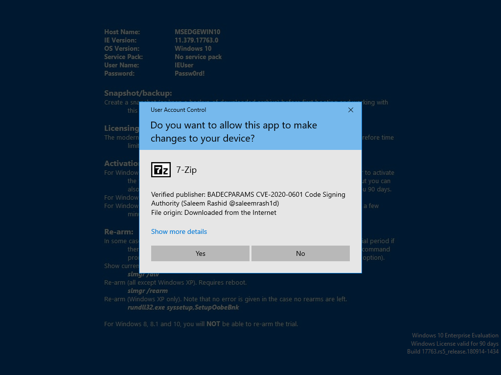
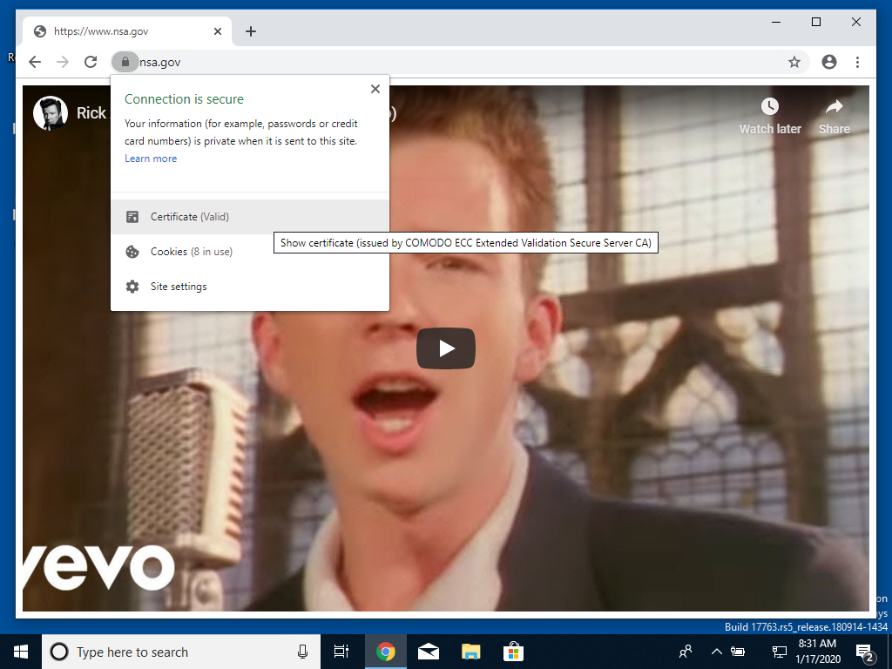

# BADECPARAMS

Proof of Concept for CVE-2020-0601.





[badecparams.py](badecparams.py) generates an intermediate certificate
authority that exploits the vulnerability, then issues Authenticode and TLS
certificates. The TLS certificates have Extended Validation in Microsoft Edge
and Internet Explorer.

[httpd.py](httpd.py) serves the contents of the [www](www) subfolder over
HTTPS, using the PEM encoded certificate chain provided on the command line.

```shell
./badecparams.py
./httpd.py localhost.key
```

### Vulnerable Software

Windows Update is not vulnerable because it uses public key pinning and RSA
keys.

The latest Windows Defender antivirus definitions detect executables signed
with malicious Authenticode certificates, even on machines without Microsoft's
patch.

Microsoft Edge, Internet Explorer, and Chromium (and derivatives) are
vulnerable to the TLS variant. Firefox is not vulnerable because Mozilla's
Network Security Services (NSS) does not support explicit EC parameters and
uses its own implementation for certificate verification.

Chrome 79.0.3945.130 fixes the vulnerability and throws
`NET::ERR_CERT_INVALID`, even on machines without Microsoft's patch.
